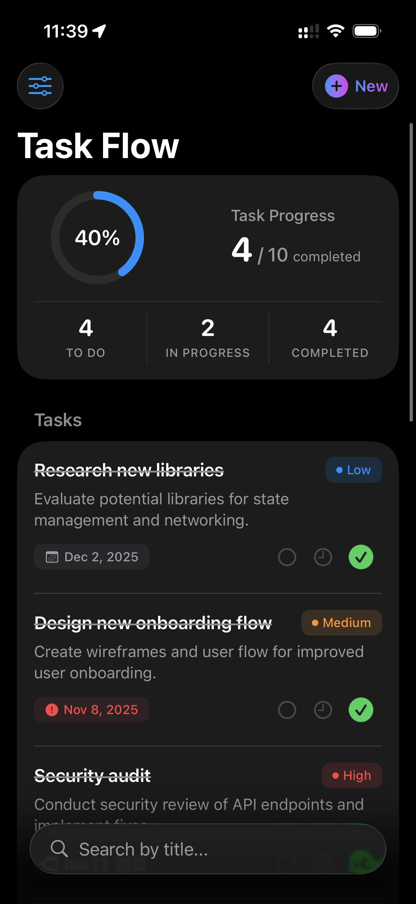
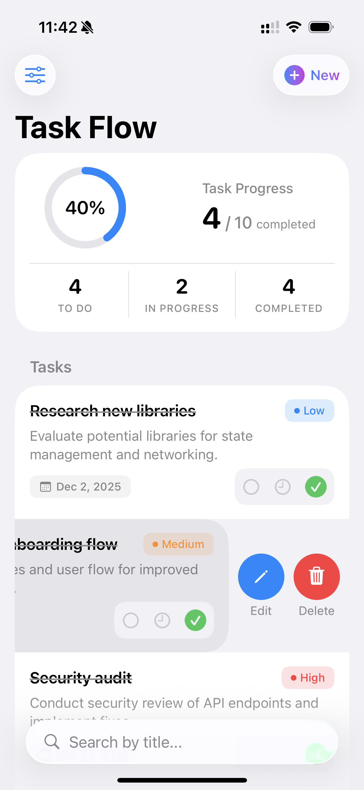
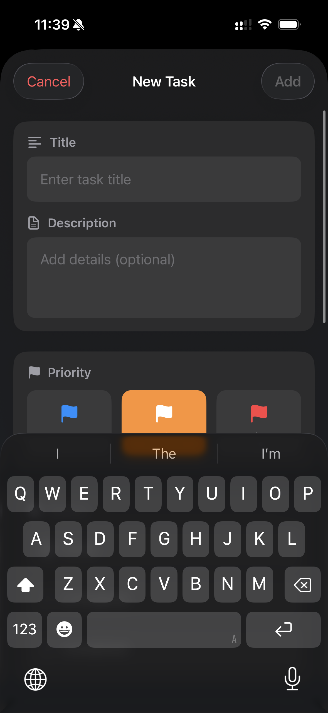
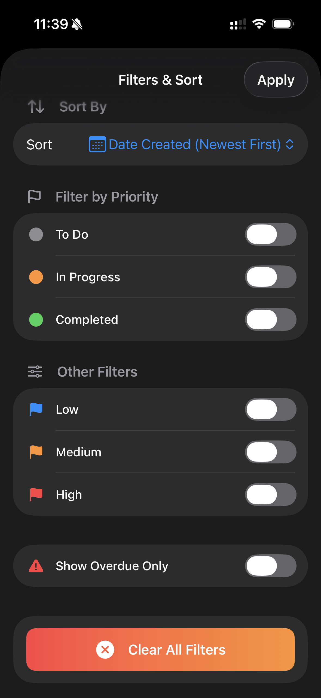
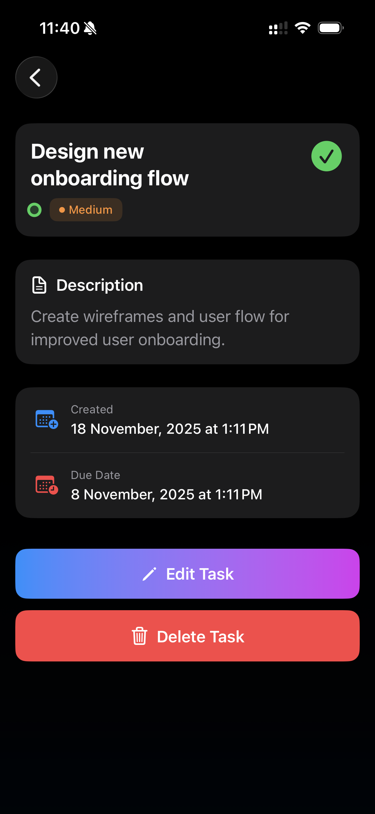
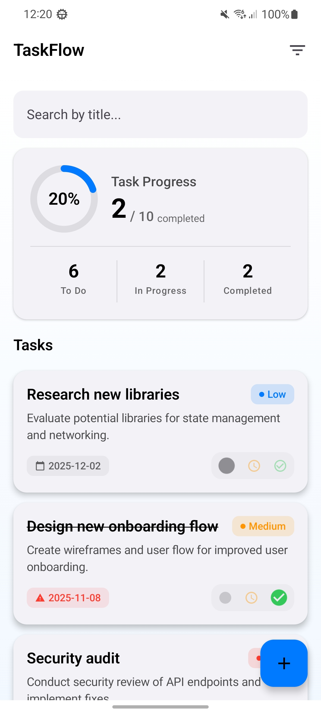
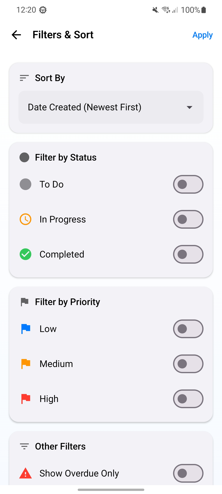
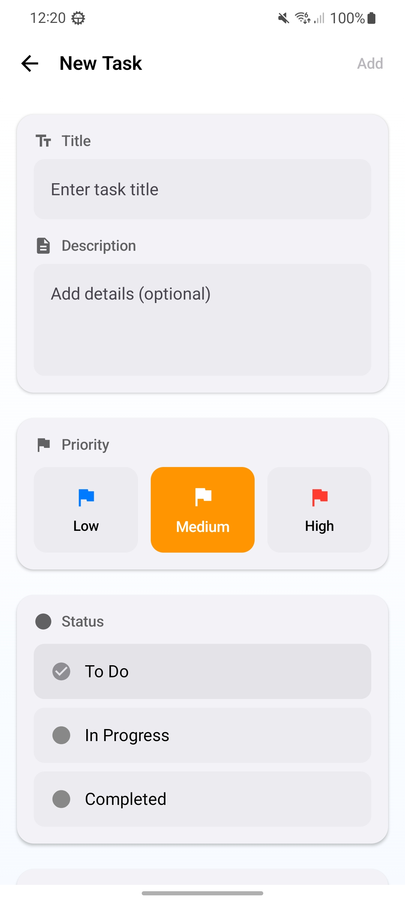
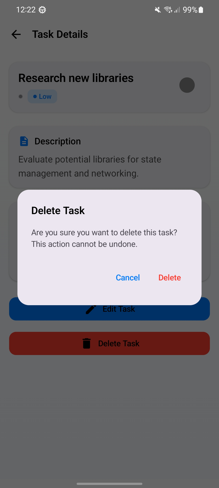

# TaskFlow

A modern, cross-platform task management application built with Kotlin Multiplatform, supporting both Android and iOS platforms with a shared business logic layer.

## 📱 Overview

TaskFlow is a full-featured task management application that demonstrates best practices in mobile development using Kotlin Multiplatform (KMP). The app provides a seamless experience across Android and iOS platforms while maximizing code reuse through a shared module architecture.

## 📸 Screenshots

### iOS
<p align="center">
  
  
  
  
  
</p>

### Android
<p align="center">
  
  
  
  
  
</p>

## 🔗 Download APK

For testing the Android version, download the APK below:

👉 **👉 [Download TaskFlow APK](https://github.com/Alims-Repo/TaskFlow/raw/main/builds/TaskFlow.apk)**

## ✨ Features

- **Task Management**: Create, read, update, and delete tasks with ease
- **Task Organization**:
    - Priority levels (Low, Medium, High)
    - Status tracking (Todo, In Progress, Done)
    - Due date scheduling with time selection
    - Search functionality
    - Filter tasks by status and priority
- **Rich Task Details**:
    - Title and description
    - Priority indicators
    - Status badges
    - Due date with overdue detection
    - Creation timestamps
- **Statistics Dashboard**: Visual overview of task metrics
- **Modern UI**: Clean, intuitive interface with Material Design 3 (Android) and native iOS design
- **Offline-First**: Local database storage using Room for data persistence

## 🏗️ Architecture

### Project Structure

```
TaskFlow/
├── composeApp/          # Android UI (Jetpack Compose)
│   └── src/
│       └── androidMain/
│           └── kotlin/com/alim/taskflow/
│               ├── core/           # Navigation, themes, components
│               ├── features/       # Feature modules (screens)
│               └── di/             # Dependency injection
├── iosApp/             # iOS UI (SwiftUI)
│   └── iosApp/
│       ├── AddTask/                        # Add task feature
│       ├── EditTask/                       # Edit task feature
│       ├── TaskList/                       # Task list feature
│       ├── TaskDetails/                    # Task details feature
│       ├── Splash/                         # Splash screen
│       ├── Core/                           # Core utilities/helpers
│       ├── ContentView.swift
│       ├── iOSApp.swift
│       └── Info.plist
├── shared/             # Shared business logic (KMP)
│   └── src/
│       ├── commonMain/    # Shared code
│       │   └── kotlin/com/alim/taskflow/
│       │       ├── data/          # Repository implementations, DAOs
│       │       ├── domain/        # Models, use cases, repository interfaces
│       │       ├── presentation/  # ViewModels
│       │       └── di/            # Dependency injection modules
│       ├── androidMain/  # Android-specific implementations
│       └── iosMain/      # iOS-specific implementations
└── gradle/               # Gradle configuration
```

### Clean Architecture Layers

1. **Presentation Layer**:
    - Android: Jetpack Compose with Material 3
    - iOS: SwiftUI with native components
    - Shared ViewModels for business logic

2. **Domain Layer** (Shared):
    - Use Cases: Encapsulated business operations
    - Models: Core domain entities (`Task`, `Priority`, `TaskStatus`)
    - Repository Interfaces: Abstract data operations

3. **Data Layer** (Shared):
    - Repository Implementations
    - Local Database (Room)
    - Data entities and mappers

## 🛠️ Technology Stack

### Shared Module
- **Kotlin Multiplatform**: Code sharing between platforms
- **Room Database**: Local data persistence
- **Kotlinx Serialization**: Data serialization
- **Kotlinx DateTime**: Cross-platform date/time handling
- **Koin**: Dependency injection
- **Coroutines & Flow**: Asynchronous operations and reactive streams

### Android (67.7%)
- **Jetpack Compose**: Modern declarative UI
- **Material Design 3**: Design system
- **Navigation Component**: Screen navigation
- **Kotlin**: Primary language

### iOS (32.3%)
- **SwiftUI**: Declarative UI framework
- **Swift**: Native iOS development

## 🚀 Getting Started

### Prerequisites

- **Android Development**:
    - Android Studio Hedgehog or later
    - JDK 11 or higher
    - Android SDK (API 24+)

- **iOS Development**:
    - Xcode 15 or later
    - macOS with Apple Silicon or Intel processor
    - CocoaPods (optional)

### Installation

1. **Clone the repository**:
```bash
git clone https://github.com/Alims-Repo/TaskFlow.git
cd TaskFlow
```

2. **Build the project**:

**For Android**:
```bash
./gradlew :composeApp:assembleDebug
```

**For iOS**:
- Open `iosApp/iosApp.xcodeproj` in Xcode
- Select your target device or simulator
- Click Run (⌘R)

3. **Run the application**:
    - **Android**: Use Android Studio's Run button or deploy via Gradle
    - **iOS**: Run from Xcode

## 📦 Modules

### `shared`
Contains all shared business logic:
- **Use Cases**: `AddTaskUseCase`, `UpdateTaskUseCase`, `DeleteTaskUseCase`, `GetAllTasksUseCase`, `SearchTasksUseCase`, `FilterTasksUseCase`, `GetTaskStatisticsUseCase`
- **Repository**: `TaskRepository` interface and `TaskRepositoryImpl`
- **Database**: Room DAO for local storage
- **ViewModels**: `TaskListViewModel`, `TaskDetailViewModel`

### `composeApp`
Android application with Jetpack Compose UI:
- **Screens**: Main, AddTask, EditTask, TaskDetails, FilterTask
- **Components**: Reusable UI components (TaskCard, StatisticsCard, SearchBar)
- **Navigation**: Type-safe navigation using serializable routes

### `iosApp`
Native iOS application with SwiftUI:
- **Views**: TaskListView, AddTaskView, TaskDetailView
- **ViewModelWrapper**: Bridge between Kotlin and Swift

## 🎨 Key Features Implementation

### Task CRUD Operations
- Create tasks with title, description, priority, status, and due date
- View task details with all metadata
- Update existing tasks
- Delete tasks with confirmation

### Search & Filter
- Real-time search by task title
- Filter by status (Todo, In Progress, Done)
- Filter by priority level

### Statistics
- Total task count
- Completed tasks tracking
- Pending tasks overview
- Progress metrics


## 📄 Configuration

### Minimum SDK Versions
- **Android**: API 24 (Android 7.0)
- **iOS**: iOS 15.0+

### Build Configuration
- **Target SDK**: Latest stable Android SDK
- **JVM Target**: Java 11
- **Kotlin Version**: Latest stable

## 👨‍💻 Author

**Alims-Repo**
- GitHub: [@Alims-Repo](https://github.com/Alims-Repo)

## 🙏 Acknowledgments

- Built with Kotlin Multiplatform
- UI powered by Jetpack Compose and SwiftUI
- Database management with Room
- Dependency injection with Koin

---

**Note**: This is a demonstration project showcasing modern mobile development practices with Kotlin Multiplatform, Clean Architecture, and cross-platform code sharing.